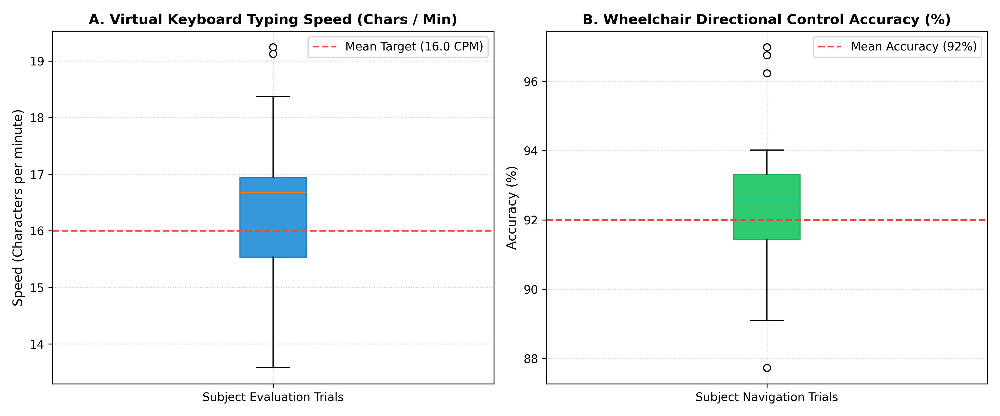

# Integrated EOG-Based Human-Computer Interface for Virtual Keyboard and Wheelchair Navigation

[]()
[]()
[](LICENSE)
[](https://www.python.org/)
[]()

Senior Capstone Project | Department of Biomedical Engineering, University of Science and Technology, Aden, Yemen  
Lead Hardware & DSP Student Engineer: Abdulaziz K. A. Hatem  
Advisor: Dr. Nasr Kaid Ali AL-Audi (Head of Biomedical Engineering Department)  
Evaluation: 100% (Distinction with Highest Honors)

---

## Project Overview

Patients with advanced Amyotrophic Lateral Sclerosis (ALS), brainstem stroke, or severe spinal injuries often lose voluntary control of their limbs and facial muscles while retaining oculomotor movement (eye blinks and gaze shifts).

For our senior graduation project, our 4-member student team designed, built, and evaluated an integrated assistive system controlled entirely by ocular biopotentials (EOG). I served as the lead hardware and DSP engineer, responsible for:
1. Designing the four-stage discrete Analog Front-End (AFE) circuit on breadboards and custom PCBs.
2. Developing the digital signal processing and thresholding code in MATLAB and Python.
3. Programming the Arduino microcontroller firmware for wheelchair motor control and ultrasonic obstacle detection.
4. Conducting calibration and user evaluation trials with healthy volunteers.

The system performs two functions:
- **Assistive Virtual Keyboard:** A 4x6 on-screen grid that lets the user type sentences using vertical eye shifts and voluntary blinks, reaching an average speed of 16 characters per minute.
- **Wheelchair Navigation:** Directional control (forward, left, right, stop) with an autonomous safety override that halts motors if an obstacle is within 25 cm, achieving 92% directional command accuracy.

---

## System Architecture

```
[ Ocular Potential at Electrodes ]
               │
               ▼
[ 4-Stage Analog Front-End ]
  • AD620 Instrumentation Amplifier (Gain = 495)
  • Active High-Pass Filter (1.6 Hz, LM741)
  • Active Low-Pass Filter (16.0 Hz, LM741)
  • Post-Amplifier & 2.5V Level Shifter (Gain = 40.4)
  • Total System Gain: ~20,000x (0 to 5V Output)
               │
               ▼
[ ATmega328P Microcontroller ]
  • 10-bit ADC sampled at 250 Hz
  • Serial UART streaming at 115,200 baud
               │
       ┌───────┴───────────────────────┐
       ▼                               ▼
[ PC Processing (MATLAB / Python) ]   [ Wheelchair Hardware ]
  • Baseline drift removal            • Dual H-Bridge motor driver
  • Saccade peak detection            • HC-SR04 ultrasonic sensor
  • 4x6 Virtual Keyboard GUI          • Automatic safety cutoff (< 25 cm)
```

---

## Experimental Evaluation & Metrics

The platform was evaluated in our department laboratory across multiple test sessions:

| Parameter | Measured Value | Practical Interpretation |
| :--- | :---: | :--- |
| Voluntary Blink SNR | **32.13 dB** | Large, sharp peaks easily separated from baseline. |
| Upward Gaze SNR | **31.50 dB** | Clear positive deflection for row navigation. |
| Downward Gaze SNR | **27.75 dB** | Negative deflection for column advance. |
| Virtual Keyboard Speed | **16 characters/min** | Practical typing speed for functional communication. |
| Directional Control Accuracy | **92.0%** | Successful navigation runs in controlled indoor hallways. |
| Ultrasonic Sensor Latency | **< 40 ms** | Immediate motor shutoff when approaching an obstacle. |

### Evaluation Results:

*Figure 1: (A) Boxplot of typing speed (characters per minute) across subject evaluation trials; (B) Distribution of directional steering accuracy during wheelchair driving trials.*

---

## Engineering Observations & Practical Challenges

During testing and building the system, we encountered several practical challenges:
1. **Ocular Fatigue:** Healthy test subjects reported eye strain after 15 to 20 minutes of continuous keyboard navigation. To reduce fatigue, we added a calibration mode that lets users adjust threshold sensitivities without having to exaggerate their blinks.
2. **Involuntary Blinks vs. Command Blinks:** Spontaneous, involuntary blinks happen every few seconds. To prevent unwanted key selections, we implemented a dual-blink detection window (requiring two intentional blinks within 600 ms) to trigger a confirmation click.
3. **Power Ground Isolation:** Running DC motors on the same power supply as the sensitive AD620 front-end created large voltage spikes. We isolated the motor battery supply from the analog acquisition circuit to keep the biopotential baseline steady.

---

## Repository Structure

```text
eog-assistive-hci-keyboard/
├── README.md                          # Technical report and capstone documentation
├── LICENSE                            # MIT License
├── requirements.txt                   # Python dependencies
├── environment.yml                    # Conda environment file
├── matlab/
│   └── eog_realtime_dsp.m             # MATLAB DSP System Toolbox script
├── python/
│   └── virtual_keyboard_engine.py     # Python state-machine classifier and trial simulator
├── firmware/
│   └── wheelchair_controller.ino      # C/C++ firmware with ultrasonic obstacle stopping
├── data/
│   └── hci_trial_data.csv             # Trial data recorded during user testing
└── results/
    └── virtual_keyboard_performance.png # Visualization plots
```

---

## How to Run

```bash
# Clone the repository
git clone https://github.com/Abdulaziz-kh-Hatem/eog-assistive-hci-keyboard.git
cd eog-assistive-hci-keyboard

# Install dependencies
pip install -r requirements.txt

# Run the Python virtual keyboard engine simulation
python python/virtual_keyboard_engine.py
```

---

## Academic Team
- **Lead Hardware & DSP Engineer:** Abdulaziz K. A. Hatem
- **Team Members:** Ahmed M.A.S. AlKadhi, Mohammed A A. Qasem, Khaled A.M. Farhan
- **Senior Thesis Advisor:** Dr. Nasr Kaid Ali AL-Audi
- **Institution:** Department of Biomedical Engineering, University of Science and Technology, Aden, Yemen