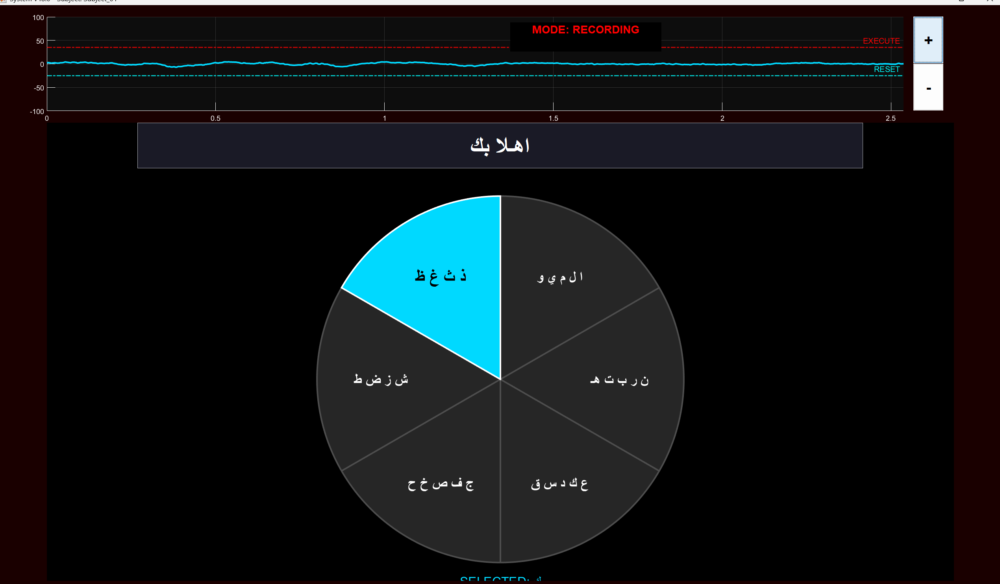
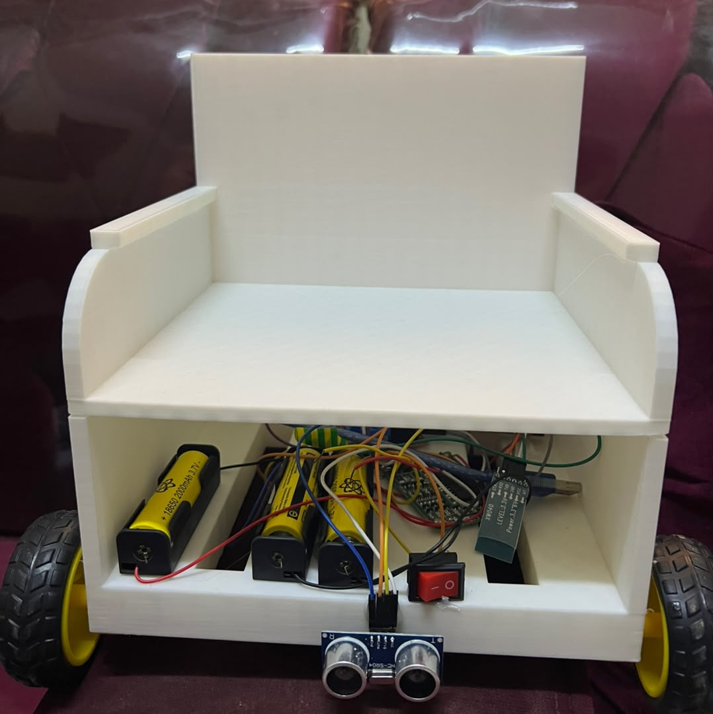

# Design and Implementation of an Integrated EOG-Based Human-Computer Interface for Virtual Keyboard and Wheelchair Control

 


> **Notice:** The source code (MATLAB and Arduino firmware) for this project is currently withheld pending the publication of our academic research paper. The code will be made publicly available once the paper is accepted and published.

Welcome to our senior capstone graduation project! We are a team of Biomedical Engineering undergraduate students from the University of Science and Technology in Aden, Yemen.

We built this system because there is a severe lack of assistive technologies designed specifically for Arab patients, especially those suffering from ALS, locked-in syndrome, or severe quadriplegia. Our goal was to create a practical, affordable system that gives patients the ability to communicate in their native language and move around independently using only their eye movements.

## What Does This System Do?
Our platform uses Electrooculography (EOG) — the electrical signals generated by eye movements — to control two main things:
1. **An Arabic Virtual Keyboard:** An on-screen interface that lets patients type Arabic text by looking at different sectors and blinking to select letters. We achieved an average typing speed of 16 characters per minute.
2. **A 3D-Printed Smart Wheelchair Prototype:** The user can steer the wheelchair (forward, reverse, left, right) with their eyes. We added ultrasonic sensors to the wheelchair so it automatically stops if it gets too close to a wall or obstacle.

---

## How It Works (System Architecture)

The system is split into two main communication paths: getting the eye signal to the laptop, and sending movement commands to the wheelchair.

1. **Signal Acquisition:** We designed an analog circuit from scratch using an AD620 amplifier to capture the tiny EOG signals from electrodes on the patient's face.
2. **Data to Laptop (USB):** An Arduino reads these amplified signals and sends them through a direct **USB Serial cable** to the laptop for fast, reliable data transfer.
3. **Signal Processing:** A MATLAB program on the laptop cleans the signal (using digital filters) and detects when the user looks up, down, or blinks.
4. **Commands to Wheelchair (Bluetooth):** If the user is in "Wheelchair Mode", MATLAB sends the movement commands wirelessly via **Bluetooth** to a second Arduino mounted on our 3D-printed wheelchair prototype.

---

## Hardware Analog Front-End (AFE)

We built the analog circuit on a breadboard using an AD620 instrumentation amplifier and TL072 op-amps. Here is how the signal is processed before reaching the Arduino:

- **Pre-Amplification:** AD620 with a gain of 6x.
- **Active Filtering:** High-pass filter (0.8 Hz) to remove DC drift, and Low-pass filter (30 Hz) to remove facial muscle noise.
- **Notch Filter:** Twin-T filter tuned exactly to 50 Hz to kill the electrical mains noise.
- **Final Amplification:** Variable gain up to 100x to make the signal readable for the Arduino's 0-5V ADC.


*Figure 1: Complete circuit schematic of the EOG analog front-end.*

---

## The Interfaces

### 1. Arabic Virtual Optical Speller
We designed this specifically for the Arab user. Instead of forcing patients to learn complicated Morse code blinks, the screen rotates through sectors of the Arabic alphabet. A strong intentional blink selects the active sector.


*Figure 2: The virtual optical speller interface.*

### 2. 3D-Printed Wheelchair Prototype
To test the physical navigation, we 3D-printed a miniature wheelchair and equipped it with L298N motor drivers and HC-SR04 ultrasonic sensors. If the sensors detect an obstacle within 40 cm, the motors stop immediately, overriding the user's eye commands to keep them safe.


*Figure 3: Our 3D-printed wheelchair prototype with the onboard battery and ultrasonic sensors.*

---

## Testing Results

We tested the system on 5 healthy student volunteers. Here is a summary of our findings:
- **Wheelchair Navigation:** Across 100 test trials, the system correctly executed the user's directional intent 94% of the time. The EOG signal decoding pipeline (DSP) introduces a latency of 143 milliseconds, with an additional 70 ms for the hardware ultrasonic interrupt response — totaling ~213 ms from decoded command to motor actuation.
- **Typing Speed:** Users were asked to type a 28-character Arabic phrase (السلام عليكم ورحمة الله وبركاته). On average, they typed 16 characters per minute (CPM), measured as mean completion time of 105.8 seconds across all participants. One of our team members who practiced extensively reached 18 CPM with 95% accuracy.
- **Note on Participants:** All 5 volunteers were healthy university students. Testing with the target clinical population (patients with ALS, locked-in syndrome, or severe quadriplegia) has not yet been conducted and is planned as future work.

---

## Repository Contents

```text
eog-assistive-hci-keyboard/
├── README.md                          
└── results/                           # Photos, schematics, and screenshots of our project
```
*(Note: Source code directories are temporarily hidden pending academic publication.)*

---

## Project Team
We are proud of what we accomplished with the resources we had. 

- **Abdulaziz K. A. Hatem** (Hardware & DSP)
- **Ahmed M.A.S. AlKadhi** 
- **Mohammed A A. Qasem** 
- **Khaled A.M. Farhan** 

**Supervised by:** Dr. Nasr Kaid Ali AL-Audi  
**Institution:** Department of Biomedical Engineering, University of Science and Technology, Aden, Yemen

---

## Related Publication

The analog front-end (AFE) hardware platform used in this project was published as a peer-reviewed paper:

> **Abdulaziz K.A. Hatem**, Ahmed M.A.S. AlKadhi, Mohammed A A. Qasem, Khaled A.M. Farhan, and Nasr Kaid Ali AL-Audi.  
> "Design and Development of a Low-Cost Electronic Platform for Electrooculography Signals Acquisition."  
> *Electrotehnica, Electronica, Automatica (EEA)*, vol. 74, no. 2, pp. 130-137, 2026. ISSN 1582-5175.  
> DOI: [10.46904/eea.26.74.2.1108016](https://doi.org/10.46904/eea.26.74.2.1108016)

See also: [eog-acquisition-platform](https://github.com/Abdulaziz-kh-Hatem/eog-acquisition-platform) — the dedicated repository for the published hardware platform.

---

## References

1. R. Barea, L. Boquete, M. Mazo, and E. López, "System for assisted mobility using eye movements based on electrooculography," *IEEE Transactions on Neural Systems and Rehabilitation Engineering*, vol. 10, no. 4, pp. 209–218, 2002.
2. A. Bulling, J. A. Ward, H. Gellersen, and G. Tröster, "Eye movement analysis for activity recognition using electrooculography," *IEEE Transactions on Pattern Analysis and Machine Intelligence*, vol. 33, no. 4, pp. 741–753, 2011.
3. Y. Chen and W. S. Newman, "A human-robot interface based on electrooculography," in *Proc. IEEE International Conference on Robotics and Automation (ICRA)*, pp. 243–248, 2004.
4. S. R. Soekadar et al., "Hybrid EEG/EOG-based brain/neural hand exoskeleton restores fully independent daily living activities after quadriplegia," *Science Robotics*, vol. 1, no. 1, eaag3296, 2016.
5. Analog Devices, "AD620 Low Cost Low Power Instrumentation Amplifier," Datasheet Rev. H, 2011.
