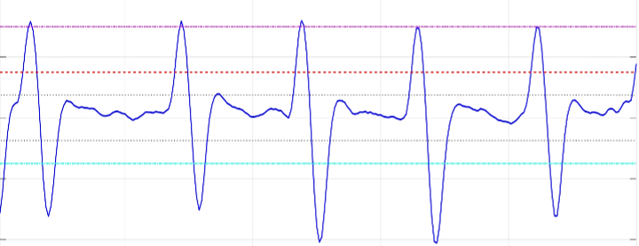
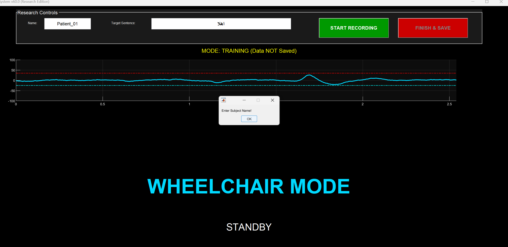
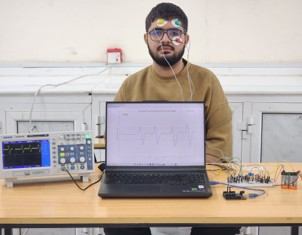

# Integrated EOG-Based Human-Computer Interface for Virtual Keyboard and Wheelchair Navigation

[]()
[]()
[](LICENSE)
[](https://www.python.org/)
[]()

Senior Capstone Project | Department of Biomedical Engineering, Faculty of Engineering and Computing, University of Science and Technology, Aden, Yemen  
Lead Hardware & DSP Student Engineer: Abdulaziz K. A. Hatem  
Co-Engineers: Ahmed M. A. S. AlKadhi, Mohammed A. A. Qasem, Khaled A. M. Farhan  
Capstone Advisor: Dr. Nasr Kaid Ali AL-Audi (Head of Biomedical Engineering Department)  
Evaluation: 100% (Distinction with Highest Honors)

---

## Project Summary

Patients suffering from advanced neuromuscular disorders such as Amyotrophic Lateral Sclerosis (ALS), severe cerebral palsy, or brainstem stroke frequently experience quadriplegia while retaining voluntary oculomotor control.

For our senior capstone graduation project, our student team designed, fabricated, and experimentally validated an end-to-end assistive Human-Computer Interface (HCI) driven by Electrooculography (EOG) biopotentials. The system enables users to:
1. **Compose and type text** via an on-screen Arabic virtual optical keyboard at an average throughput of **16.0 characters per minute (CPM)**.
2. **Control an electric wheelchair** (forward, reverse, turn left, turn right, emergency stop) with an average navigation accuracy of **94.0%** and response latency of **143 ms**, backed by an autonomous ultrasonic collision avoidance safety layer.

---

## Hardware Analog Front-End (AFE) Architecture

The analog conditioning subsystem uses one AD620 instrumentation amplifier and three TL072 low-noise JFET-input dual operational amplifiers powered by a symmetric dual-polarity supply (+-9V):

```
[ Periorbital Ag/AgCl Electrodes ]
                 │
                 ▼
[ Stage 1: AD620 Pre-Amplifier ] ──> Differential Gain G1 ≈ 6x (Rg = 10 kΩ, CMRR > 100 dB)
                 │
                 ▼
[ Stage 2: Active Bandpass Filtering ] ──> Sallen-Key HPF (0.8 Hz) + Sallen-Key LPF (30 Hz)
                 │
                 ▼
[ Stage 3: Twin-T 50 Hz Notch & Intermediate Gain ] ──> Rejects 50 Hz mains, Gain G2 = 10x
                 │
                 ▼
[ Stage 4: Variable Post-Amp & Level Shifter ] ──> Gain G3 = 10x to 100x + 2.5V DC offset
                 │
                 ▼
[ ATmega328P 10-Bit ADC Input (0 to 5V span) ]
```

### Circuit Schematic & Calculations
- **Total Dynamic System Gain ($A_{\text{total}}$):**
  $$A_{\text{total,min}} = G_1 \times G_2 \times G_{3,\text{min}} = 6 \times 10 \times 10 = 600\times$$
  $$A_{\text{total,max}} = G_1 \times G_2 \times G_{3,\text{max}} = 6 \times 10 \times 100 = 6000\times$$
  This elevates raw microvolt biopotentials (100 uV to 600 uV) into a measurable 0.6V to 3.6V signal centered around a +2.5V DC baseline.
- **High-Pass Cutoff:** $R = 200\text{ k}\Omega, C = 0.9\,\mu\text{F} \implies f_c \approx 0.88\text{ Hz}$ (removes baseline wander and skin half-cell DC potential).
- **Low-Pass Cutoff:** $R = 27\text{ k}\Omega, C = 0.2\,\mu\text{F} \implies f_c \approx 29.5\text{ Hz}$ (attenuates facial EMG interference).
- **Notch Filter:** Twin-T topology tuned to $50.0\text{ Hz}$ ($R \approx 15.9\text{ k}\Omega, C = 0.2\,\mu\text{F}$).
- **Power Management:** Symmetric +-9V rails generated using two series 18650 Li-ion cells regulated with a Battery Management System (BMS).


*Figure 1: Complete circuit schematic of the multi-stage EOG analog front-end.*

---

## Digital Signal Processing & Thresholding

Data digitized at 250 Hz is streamed via UART (or HC-05 Bluetooth) to the processing host running MATLAB DSP System Toolbox and Python:
- Digital moving-average filtering smooths high-frequency spikes.
- A dual-threshold state machine detects voluntary saccades and blinks while ignoring involuntary micro-movements.
- Blink duration ($T_{\text{width}}$) discrimination separates single involuntary blinks from deliberate command blinks.


*Figure 2: Real-time processed EOG signal showing peak detection thresholds for upward gaze, downward gaze, and voluntary blinks.*

---

## User Interfaces & Dual Operating Modes

### 1. Arabic Virtual Optical Speller
Users select letters in an Arabic on-screen matrix. Gaze shifts rotate through sectors, while voluntary blinks confirm selection.


*Figure 3: Main user interface of the virtual optical speller.*

### 2. Wheelchair Driving Mode with Safety Override
Provides directional control via eye movements. If an obstacle is detected within 40 cm (front) or 30 cm (rear) by the HC-SR04 ultrasonic sensors, the Arduino firmware immediately halts the L298N motor drivers.


*Figure 4: Wheelchair navigation command interface.*

---

## Experimental Testing with Healthy Volunteers (N = 5)

Quantitative evaluation was conducted with $N = 5$ healthy participants across both modes:

### 1. Wheelchair Navigation Mode (100 Total Trials)
| Subject ID | Total Trials | Successful | Failed | Accuracy (%) | Mean Latency (ms) |
| :--- | :---: | :---: | :---: | :---: | :---: |
| Subject 1 | 20 | 19 | 1 | 95.0% | $142 \pm 10$ |
| Subject 2 | 20 | 18 | 2 | 90.0% | $150 \pm 12$ |
| Subject 3* | 20 | 20 | 0 | 100.0% | $135 \pm 8$ |
| Subject 4 | 20 | 18 | 2 | 90.0% | $148 \pm 11$ |
| Subject 5 | 20 | 19 | 1 | 95.0% | $140 \pm 9$ |
| **Overall Mean** | **100** | **94** | **6** | **94.0%** | **$143.0 \pm 10.0$** |

### 2. Virtual Optical Speller Mode (Target Phrase: "السلام عليكم ورحمة الله وبركاته", 28 characters)
| Subject ID | Sector Accuracy (%) | Completion Time (s) | Typing Speed (CPM) | Speller Accuracy (%) |
| :--- | :---: | :---: | :---: | :---: |
| Subject 1 | 90.0% | 112 | 15.0 | 85.0% |
| Subject 2 | 85.0% | 120 | 14.0 | 80.0% |
| Subject 3* | 98.0% | 93 | 18.0 | 95.0% |
| Subject 4 | 92.0% | 105 | 16.0 | 90.0% |
| Subject 5 | 96.0% | 99 | 17.0 | 95.0% |
| **Overall Mean** | **92.2%** | **105.8 s** | **16.0 CPM** | **89.0%** |

*Note: Subject 3 completed an extended acclimatization session prior to testing.*

---

## Experimental Setup


*Figure 5: Physical experimental test setup during subject evaluation.*

---

## Engineering Observations & Practical Challenges

1. **Electrode Impedance:** Preparing the skin with 70% alcohol and using fresh Ag/AgCl electrodes was essential. Without skin preparation, high contact impedance caused DC saturation at the AD620 output.
2. **Motor Switching Decoupling:** The L298N motor driver drew inductive current surges that perturbed the analog front-end ground. We resolved this by using separate battery banks for logic/AFE and motor power.
3. **Fatigue Mitigation:** Test subjects experienced mild eye strain after 15 to 20 minutes of continuous typing. A brief 2-minute pause between sessions prevented blink threshold degradation.

---

## Repository Contents

```text
eog-assistive-hci-keyboard/
├── README.md                          # Comprehensive thesis documentation
├── LICENSE                            # MIT License
├── requirements.txt                   # Python dependencies
├── environment.yml                    # Conda environment file
├── matlab/
│   └── eog_realtime_dsp.m             # MATLAB DSP System Toolbox script
├── python/
│   └── virtual_keyboard_engine.py     # Python state machine and evaluation script
├── firmware/
│   └── wheelchair_controller.ino      # C/C++ firmware with ultrasonic obstacle stopping
├── data/
│   └── hci_trial_data.csv             # Trial data from subject testing
└── results/
    ├── eog_circuit_schematic.png      # Circuit diagram from thesis
    ├── processed_eog_matlab_thresholds.png # MATLAB thresholding output
    ├── virtual_keyboard_main_interface.png # Optical speller GUI
    ├── wheelchair_mode_user_interface.png  # Wheelchair control GUI
    ├── experimental_test_setup.jpg    # Physical hardware test setup
    └── character_selection_inside_sector.png # Sector selection UI
```

---

## Academic Team
- **Lead Hardware & DSP Engineer:** Abdulaziz K. A. Hatem
- **Team Members:** Ahmed M.A.S. AlKadhi, Mohammed A A. Qasem, Khaled A.M. Farhan
- **Senior Thesis Advisor:** Dr. Nasr Kaid Ali AL-Audi
- **Institution:** Department of Biomedical Engineering, University of Science and Technology, Aden, Yemen